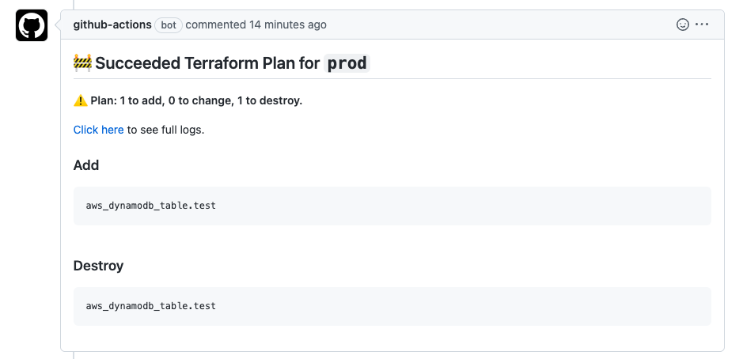

# github-terraform-plan-comment-action

GitHub Action for putting terraform plan result as a PR comment.



## Inputs

| Name           | Description                                   | Required | Default               |
|----------------|-----------------------------------------------|----------|-----------------------|
| `plan-job`     | Job name where `terraform plan` has been run  | Yes      | N/A                   |
| `plan-step`    | Step name where `terraform plan` has been run | Yes      | N/A                   |
| `workspace`    | Terraform workspace name                      | No       | N/A                   |
| `github-token` | GitHub token                                  | No       | `${{ github.token }}` | 

## Usage

Use this action after the job where you run `terraform plan`.

```yaml

  plan:
    runs-on: ubuntu-latest
    steps:
      # ... other steps
      
      - name: Run terraform plan
        run: terraform plan

  after-plan:
    runs-on: ubuntu-latest
    needs:
      - plan
    steps:
      - name: Checkout
        uses: actions/checkout@v3
      - name: Notify terraform plan result as PR comment
        uses: kota65535/github-terraform-plan-comment-action
        with:
          plan-job: plan
          plan-step: Run terraform plan for dev
```
